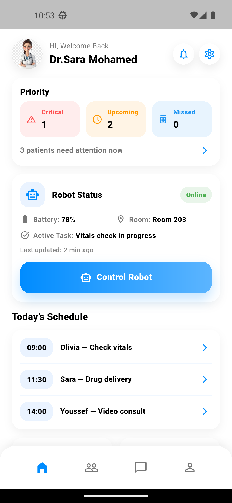
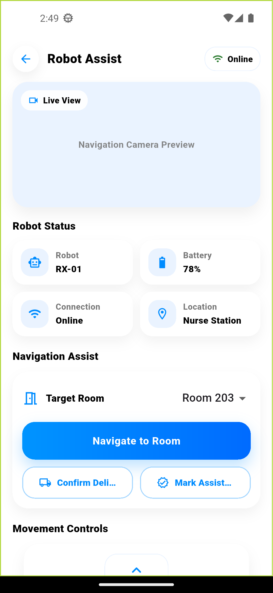
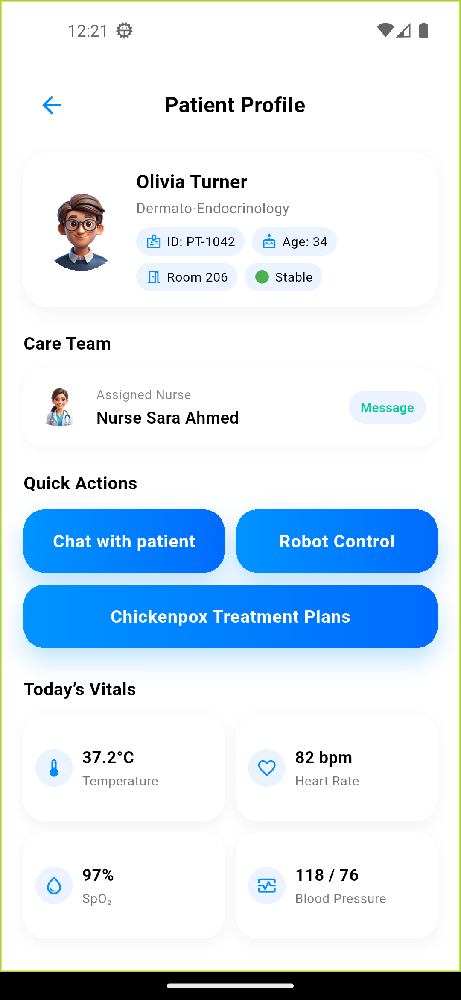

# HealMate UI

A Flutter mobile application UI designed to control and interact with a healthcare robot.

## ✨ Features
- Robot control interface
- Health monitoring UI
- Clean and modern Flutter UI

## 🛠️ Built With
- Flutter
- Dart

## 📌 Status
UI completed. Robot integration in progress.

## 📸 Screenshots

(screenshots/robot_control2.png)

