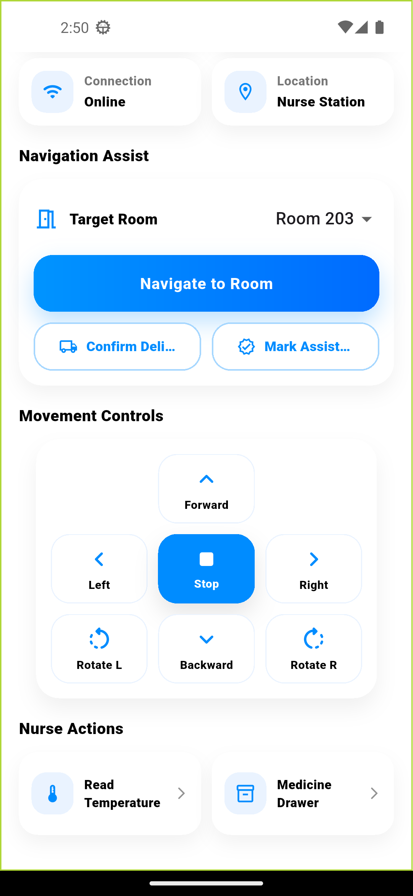

# 🩺 HealMate - Smart Medical Assistant App

## 📱 About The Project
HealMate is a smart healthcare mobile application designed to assist users with medical information, health tracking, and AI-powered support features.

The app focuses on providing an intuitive user experience while integrating modern Flutter development practices.

---

## ✨ Main Features
- 🔐 User Authentication
- 🩺 Medical Dashboard
- 🤖 AI-based Assistance
- 📅 Smart Scheduler
- 📊 Health Data Visualization
- 📱 Clean & Responsive UI
- 🔔 Notifications & Reminders

---

## 🛠️ Tech Stack
- Flutter
- Dart
- Firebase
- REST APIs
- State Management (Provider / Bloc)
- Local Storage

---

## 🧠 Architecture
The project follows a scalable structure to support future feature expansion and backend integrations.

---

## 📸 Screenshots

1. Home  

3. Robot Control  

4. Patient Profile  

---

## 🚀 Getting Started

### Clone repository
https://github.com/Faridamahmouudd/heal_mate_ui.git

### Install dependencies
flutter pub get 

### Run the app
flutter run

---

## 👩‍💻 Developer
Built using Flutter as a smart healthcare assistant application.
